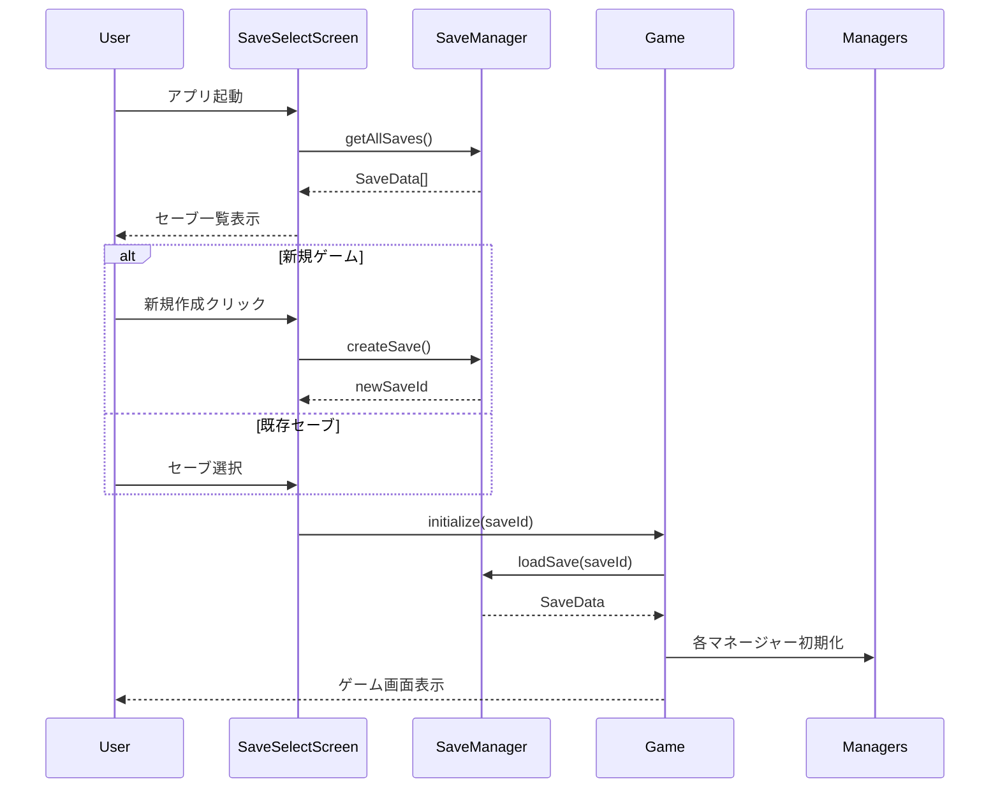
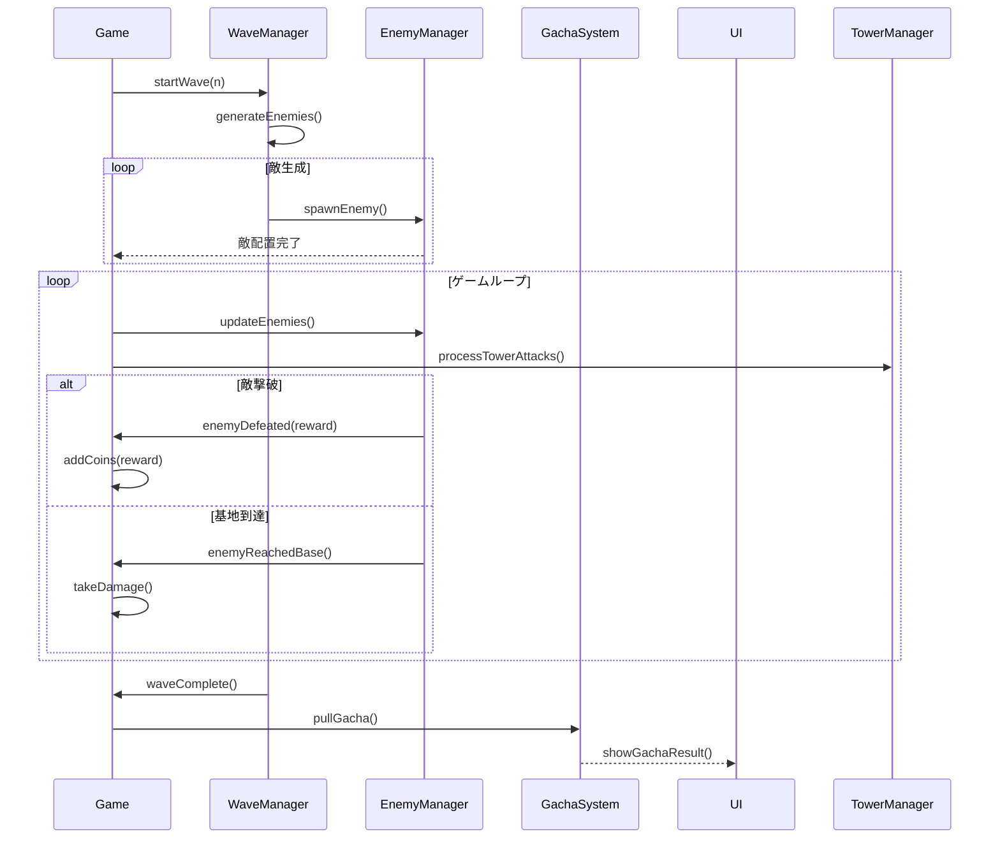
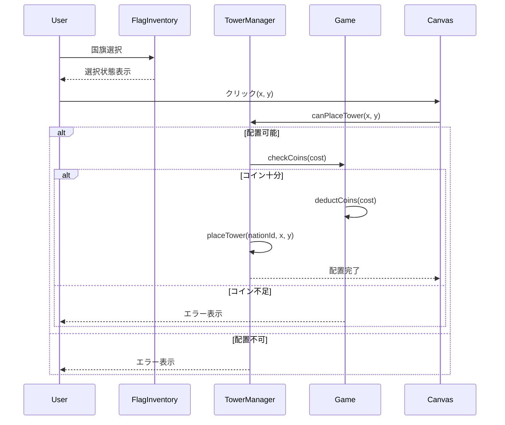
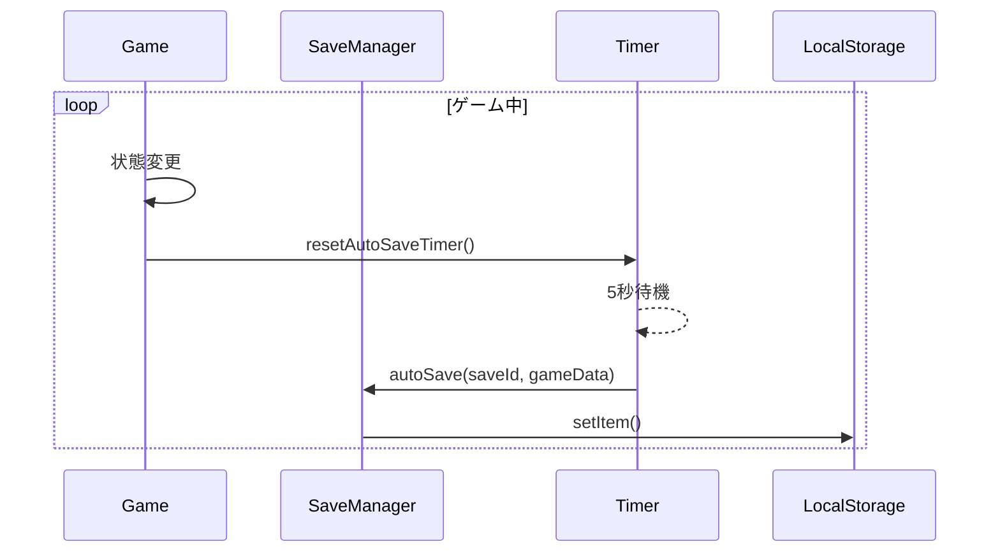
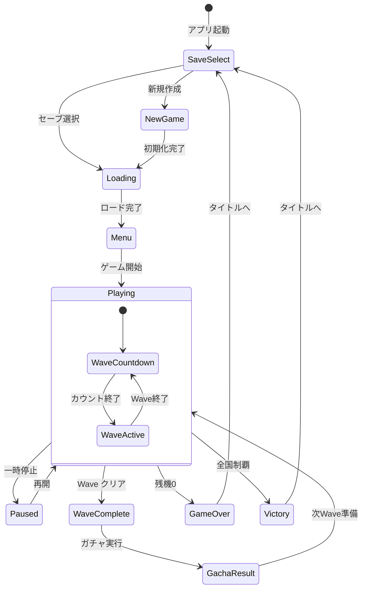
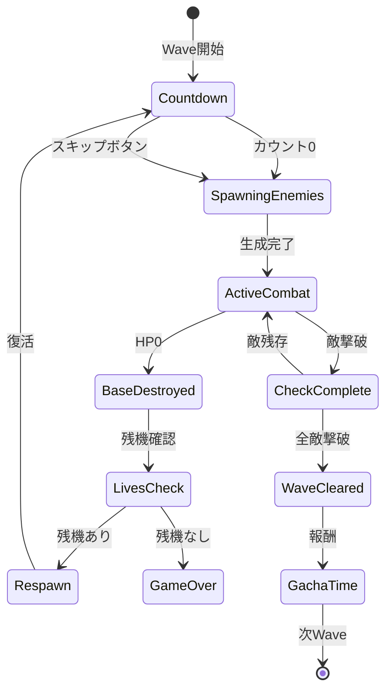
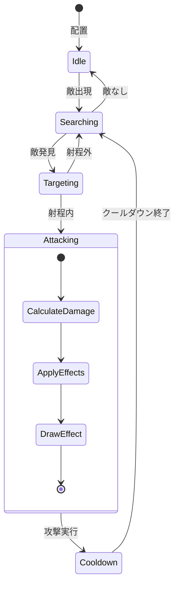
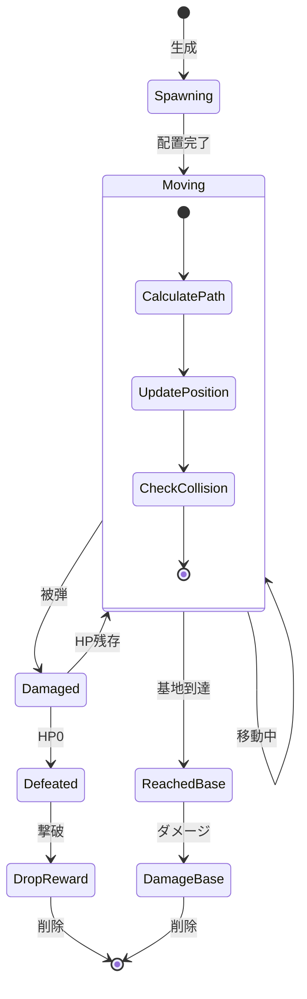

# シーケンス図と状態遷移図

## シーケンス図

### 1. ゲーム開始シーケンス

### 2. Wave進行シーケンス

### 3. タワー配置シーケンス

### 4. オートセーブシーケンス

## 状態遷移図

### 1. ゲーム全体の状態遷移

### 2. Wave状態遷移

### 3. タワー状態遷移

### 4. 敵状態遷移

## イベントフロー

### ユーザー操作イベント
1. **セーブ選択** → Game初期化
2. **国旗選択** → 配置モード
3. **キャンバスクリック** → タワー配置/選択
4. **アップグレード購入** → タワー強化
5. **Wave開始** → 戦闘開始
6. **一時停止** → ゲーム停止

### システムイベント
1. **Wave完了** → ガチャ → 次Wave準備
2. **基地破壊** → 残機確認 → 復活/ゲームオーバー
3. **オートセーブ** → LocalStorage更新
4. **全国制覇** → エンディング