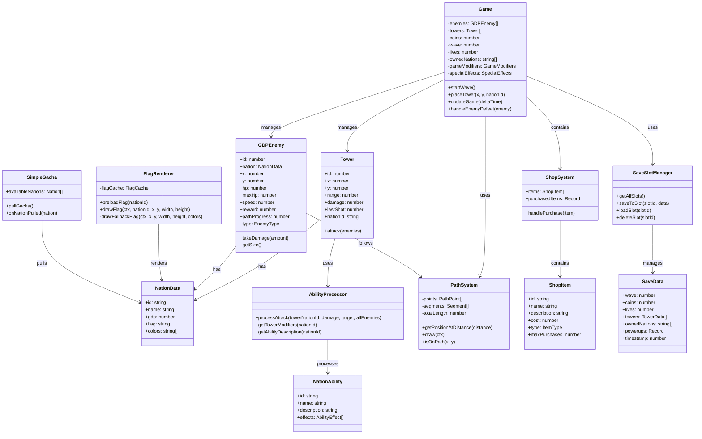

# Flag Defence - クラス図

## 主要クラスの説明

### Game
メインゲームクラス。全体のゲーム状態を管理し、ゲームループを制御します。

### Tower
タワークラス。配置位置、攻撃範囲、ダメージ、所属国家を持ちます。

### GDPEnemy
敵クラス。GDPベースのHP、速度、報酬を持ち、パスに沿って移動します。

### PathSystem
パスシステム。敵の移動経路を管理し、位置計算を行います。

### NationAbility & AbilityProcessor
国家別の特殊能力を定義し、攻撃時の処理を行います。

### FlagRenderer
国旗の描画を担当。画像のプリロードとフォールバック描画を管理します。

### ShopSystem
ショップ機能。パワーアップアイテムや残機の購入を管理します。

### SaveSlotManager
10個のセーブスロットを管理し、セーブ/ロード機能を提供します。

### SimpleGacha
ガチャシステム。ランダムに国家を獲得する機能を提供します。