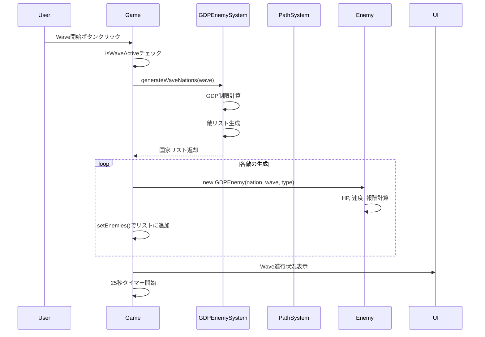
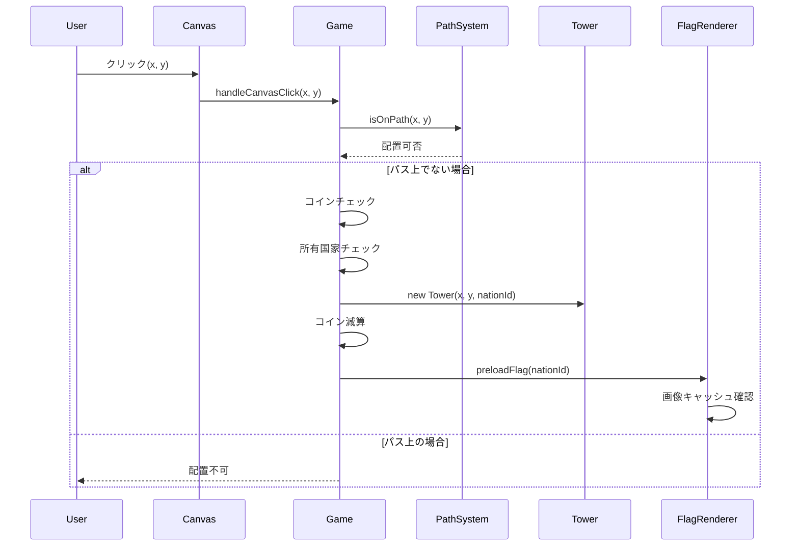
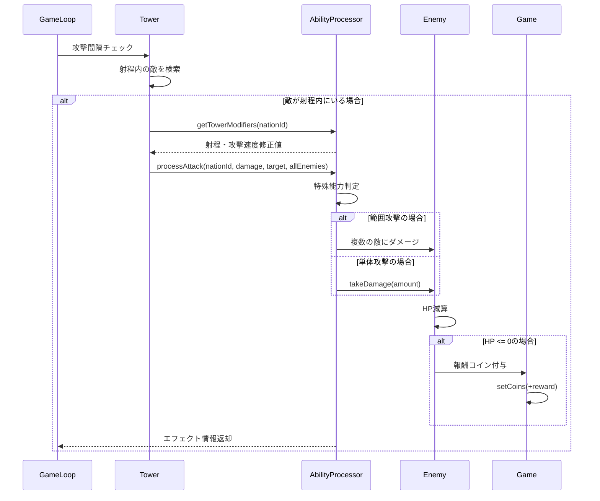
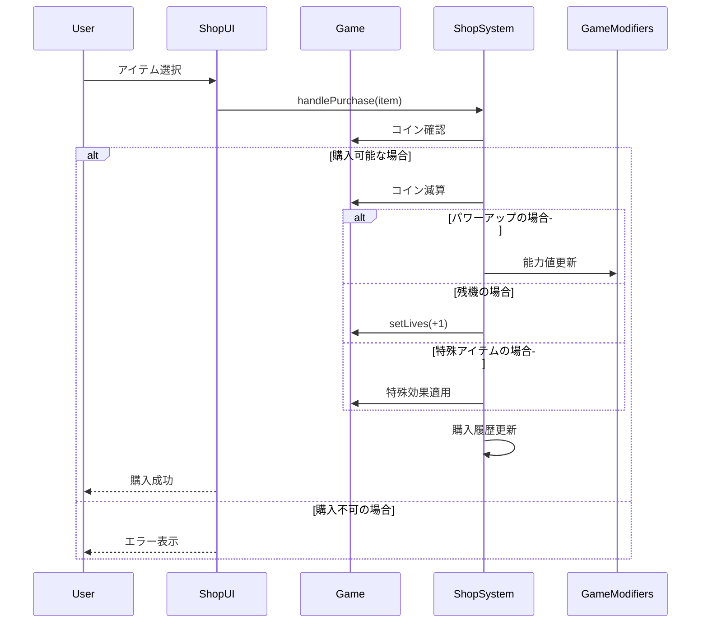
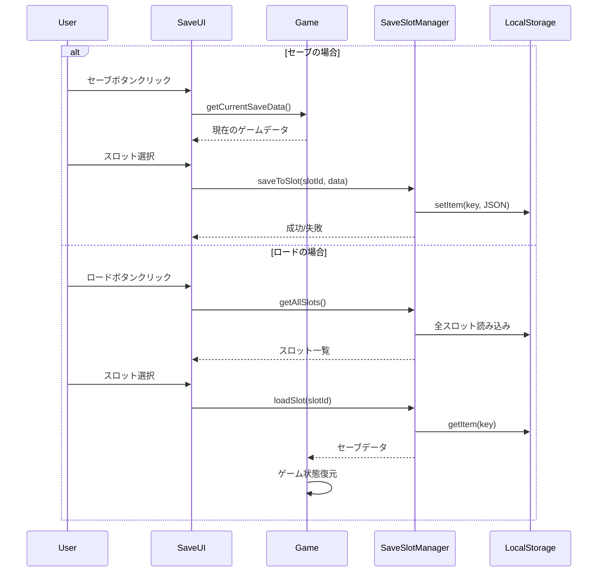
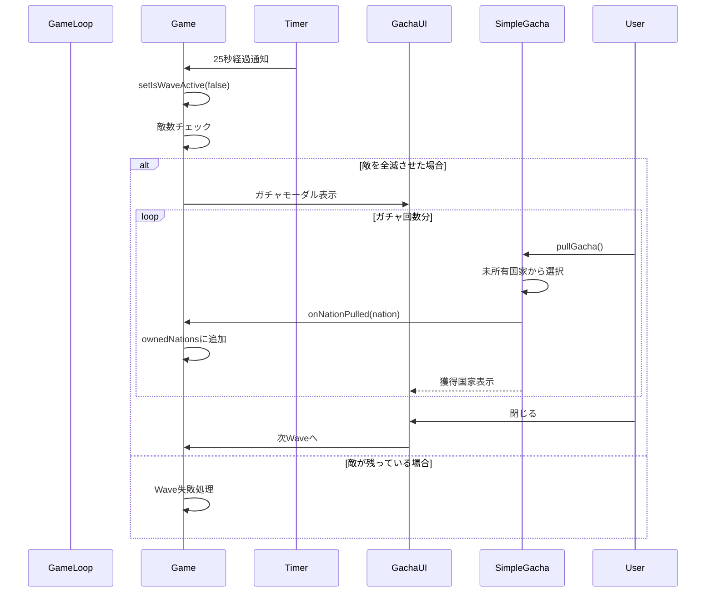

# Flag Defence - シーケンス図

## 1. Wave開始シーケンス

```mermaid
sequenceDiagram
    participant User
    participant Game
    participant GDPEnemySystem
    participant PathSystem
    participant Enemy
    participant UI

    User->>Game: Wave開始ボタンクリック
    Game->>Game: isWaveActiveチェック
    Game->>GDPEnemySystem: generateWaveNations(wave)
    GDPEnemySystem->>GDPEnemySystem: GDP制限計算
    GDPEnemySystem->>GDPEnemySystem: 敵リスト生成
    GDPEnemySystem-->>Game: 国家リスト返却
    
    loop 各敵の生成
        Game->>Enemy: new GDPEnemy(nation, wave, type)
        Enemy->>Enemy: HP, 速度, 報酬計算
        Game->>Game: setEnemies()でリストに追加
    end
    
    Game->>UI: Wave進行状況表示
    Game->>Game: 25秒タイマー開始
```

## 2. タワー配置シーケンス

```mermaid
sequenceDiagram
    participant User
    participant Canvas
    participant Game
    participant PathSystem
    participant Tower
    participant FlagRenderer

    User->>Canvas: クリック(x, y)
    Canvas->>Game: handleCanvasClick(x, y)
    Game->>PathSystem: isOnPath(x, y)
    PathSystem-->>Game: 配置可否
    
    alt パス上でない場合
        Game->>Game: コインチェック
        Game->>Game: 所有国家チェック
        Game->>Tower: new Tower(x, y, nationId)
        Game->>Game: コイン減算
        Game->>FlagRenderer: preloadFlag(nationId)
        FlagRenderer->>FlagRenderer: 画像キャッシュ確認
    else パス上の場合
        Game-->>User: 配置不可
    end
```

## 3. 攻撃処理シーケンス

```mermaid
sequenceDiagram
    participant GameLoop
    participant Tower
    participant AbilityProcessor
    participant Enemy
    participant Game

    GameLoop->>Tower: 攻撃間隔チェック
    Tower->>Tower: 射程内の敵を検索
    
    alt 敵が射程内にいる場合
        Tower->>AbilityProcessor: getTowerModifiers(nationId)
        AbilityProcessor-->>Tower: 射程・攻撃速度修正値
        Tower->>AbilityProcessor: processAttack(nationId, damage, target, allEnemies)
        AbilityProcessor->>AbilityProcessor: 特殊能力判定
        
        alt 範囲攻撃の場合
            AbilityProcessor->>Enemy: 複数の敵にダメージ
        else 単体攻撃の場合
            AbilityProcessor->>Enemy: takeDamage(amount)
        end
        
        Enemy->>Enemy: HP減算
        alt HP <= 0の場合
            Enemy->>Game: 報酬コイン付与
            Game->>Game: setCoins(+reward)
        end
        
        AbilityProcessor-->>GameLoop: エフェクト情報返却
    end
```

## 4. ショップ購入シーケンス

```mermaid
sequenceDiagram
    participant User
    participant ShopUI
    participant Game
    participant ShopSystem
    participant GameModifiers

    User->>ShopUI: アイテム選択
    ShopUI->>ShopSystem: handlePurchase(item)
    ShopSystem->>Game: コイン確認
    
    alt 購入可能な場合
        ShopSystem->>Game: コイン減算
        
        alt パワーアップの場合
            ShopSystem->>GameModifiers: 能力値更新
        else 残機の場合
            ShopSystem->>Game: setLives(+1)
        else 特殊アイテムの場合
            ShopSystem->>Game: 特殊効果適用
        end
        
        ShopSystem->>ShopSystem: 購入履歴更新
        ShopUI-->>User: 購入成功
    else 購入不可の場合
        ShopUI-->>User: エラー表示
    end
```

## 5. セーブ/ロードシーケンス

```mermaid
sequenceDiagram
    participant User
    participant SaveUI
    participant Game
    participant SaveSlotManager
    participant LocalStorage

    alt セーブの場合
        User->>SaveUI: セーブボタンクリック
        SaveUI->>Game: getCurrentSaveData()
        Game-->>SaveUI: 現在のゲームデータ
        User->>SaveUI: スロット選択
        SaveUI->>SaveSlotManager: saveToSlot(slotId, data)
        SaveSlotManager->>LocalStorage: setItem(key, JSON)
        SaveSlotManager-->>SaveUI: 成功/失敗
    else ロードの場合
        User->>SaveUI: ロードボタンクリック
        SaveUI->>SaveSlotManager: getAllSlots()
        SaveSlotManager->>LocalStorage: 全スロット読み込み
        SaveSlotManager-->>SaveUI: スロット一覧
        User->>SaveUI: スロット選択
        SaveUI->>SaveSlotManager: loadSlot(slotId)
        SaveSlotManager->>LocalStorage: getItem(key)
        SaveSlotManager-->>Game: セーブデータ
        Game->>Game: ゲーム状態復元
    end
```

## 6. Wave完了・ガチャシーケンス

```mermaid
sequenceDiagram
    participant GameLoop
    participant Game
    participant Timer
    participant GachaUI
    participant SimpleGacha

    Timer->>Game: 25秒経過通知
    Game->>Game: setIsWaveActive(false)
    Game->>Game: 敵数チェック
    
    alt 敵を全滅させた場合
        Game->>GachaUI: ガチャモーダル表示
        
        loop ガチャ回数分
            User->>SimpleGacha: pullGacha()
            SimpleGacha->>SimpleGacha: 未所有国家から選択
            SimpleGacha->>Game: onNationPulled(nation)
            Game->>Game: ownedNationsに追加
            SimpleGacha-->>GachaUI: 獲得国家表示
        end
        
        User->>GachaUI: 閉じる
        GachaUI->>Game: 次Waveへ
    else 敵が残っている場合
        Game->>Game: Wave失敗処理
    end
```