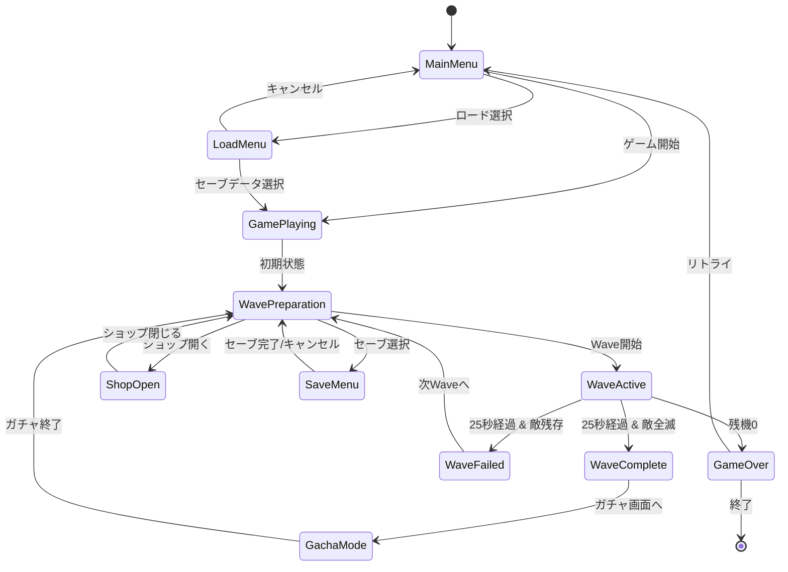
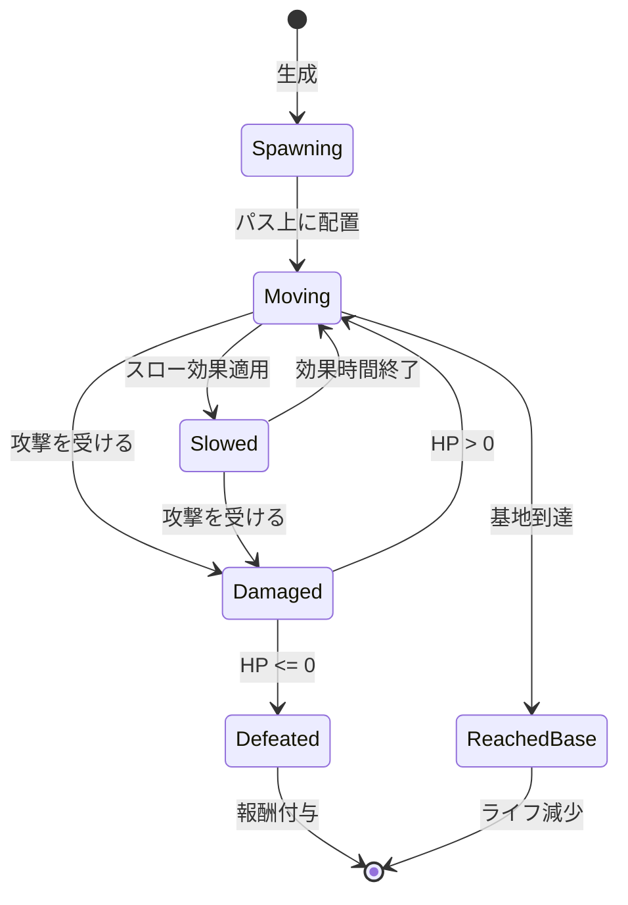
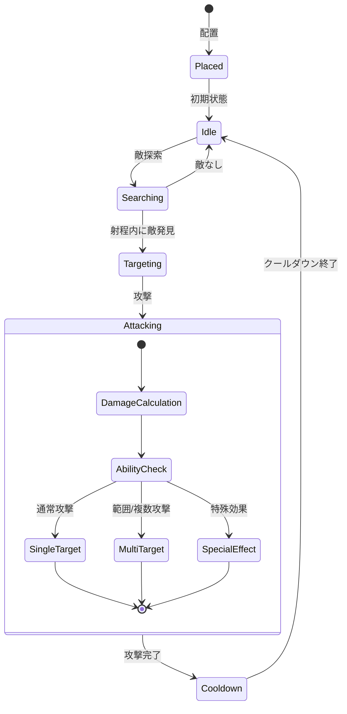
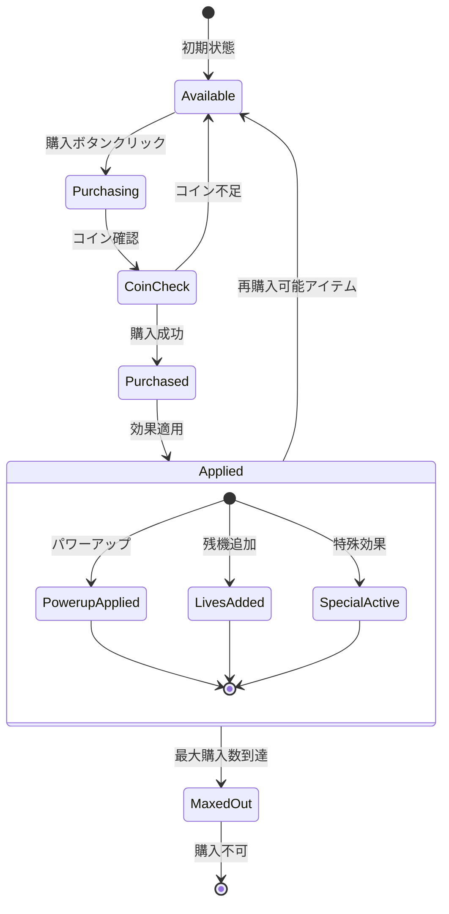
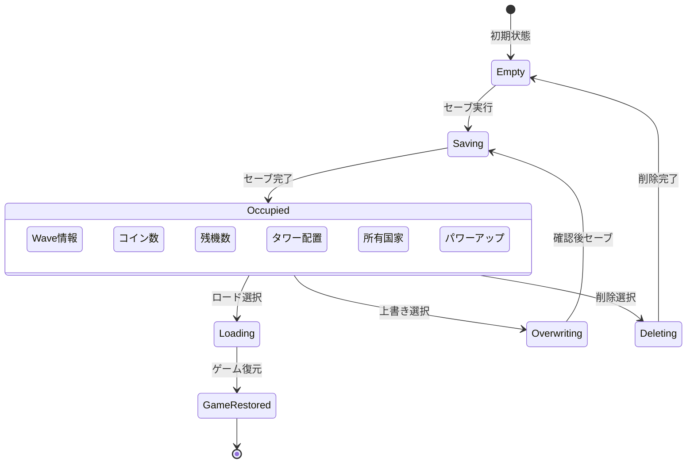
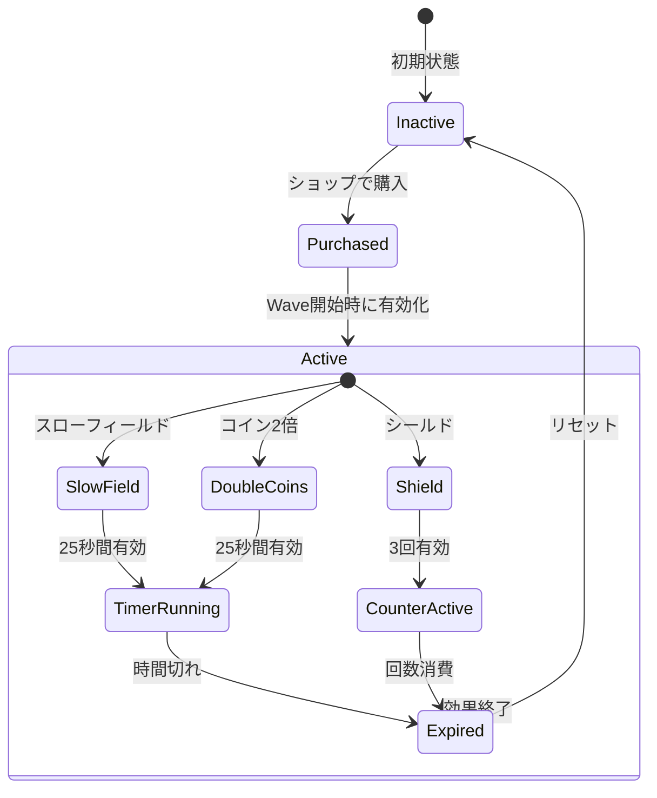

# Flag Defence - 状態図

## 1. ゲーム全体の状態遷移

## 2. Wave中の敵の状態遷移

## 3. タワーの状態遷移

## 4. ショップアイテムの状態遷移

## 5. セーブスロットの状態遷移

## 6. 特殊効果の状態遷移

## 状態管理の重要ポイント

1. **Wave状態管理**: 25秒のタイマーと敵の生存状態で判定
2. **敵の状態**: 移動中、スロー中、撃破の3つの主要状態
3. **タワーの状態**: アイドル、ターゲティング、攻撃、クールダウンのサイクル
4. **ショップアイテム**: 購入可能数の管理と効果の即時/持続判定
5. **セーブスロット**: 10個の独立したスロットの状態管理
6. **特殊効果**: Wave単位での有効/無効切り替え