# クラス図

```mermaid
classDiagram
    %% Core Game Classes
    class Game {
        -gameState: GameState
        -currentSaveId: string
        -saveManager: SaveManager
        -waveManager: WaveManager
        -towerManager: TowerManager
        -enemyManager: EnemyManager
        -gachaSystem: GachaSystem
        -effectManager: EffectManager
        +start()
        +pause()
        +resume()
        +gameLoop()
        +handleWaveComplete()
    }

    class GameState {
        +state: string
        +wave: number
        +coins: number
        +lives: number
        +baseHealth: number
        +difficulty: string
        +isWaveActive: boolean
    }

    %% Save System
    class SaveManager {
        -STORAGE_KEY: string
        -MAX_SAVES: number
        +getAllSaves(): SaveData[]
        +createSave(name, gameData): SaveData
        +updateSave(saveId, gameData): boolean
        +deleteSave(saveId): boolean
        +loadSave(saveId): SaveData
        +autoSave(saveId, gameData): void
        +exportSave(saveId): string
        +importSave(data): SaveData
    }

    class SaveData {
        +id: string
        +name: string
        +createdAt: number
        +updatedAt: number
        +gameData: GameData
    }

    %% Wave Management
    class WaveManager {
        -currentWave: number
        -enemySpawnQueue: Enemy[]
        -waveCountdown: number
        +startWave(waveNumber): void
        +generateEnemies(wave): Enemy[]
        +checkWaveComplete(): boolean
        +getWaveReward(wave): number
    }

    %% Tower System
    class TowerManager {
        -placedTowers: Tower[]
        -selectedTower: Tower
        +placeTower(nationId, x, y): Tower
        +removeTower(towerId): void
        +upgradeTower(towerId, upgrade): void
        +getTowersInRange(position): Tower[]
    }

    class Tower {
        +id: string
        +nationId: string
        +position: Position
        +level: number
        +upgrades: string[]
        +lastShotTime: number
        +getStats(): TowerStats
        +shoot(target): void
        +canShoot(target): boolean
    }

    %% Enemy System
    class EnemyManager {
        -enemies: Enemy[]
        -pathSystem: PathSystem
        +spawnEnemy(type, nationId): Enemy
        +updateEnemies(deltaTime): void
        +removeEnemy(enemyId): void
        +getEnemiesInRange(position, range): Enemy[]
    }

    class Enemy {
        +id: string
        +nationId: string
        +type: string
        +position: Position
        +hp: number
        +maxHp: number
        +speed: number
        +pathProgress: number
        +takeDamage(amount): void
        +move(deltaTime): void
        +reachedBase(): boolean
    }

    %% Gacha System
    class GachaSystem {
        -ownedNations: string[]
        -nationDatabase: Nation[]
        +pullGacha(): Nation
        +getAvailableNations(): Nation[]
        +getRarity(gdp): Rarity
        +addNation(nationId): void
    }

    class Nation {
        +id: string
        +name: string
        +gdp: number
        +colors: string[]
        +flag: string
        +specialAbility: SpecialAbility
    }

    %% Effect System
    class EffectManager {
        -activeEffects: Map
        +addEffect(type, params): void
        +updateEffects(deltaTime): void
        +drawEffects(ctx): void
        +clearEffects(): void
    }

    class AttackEffect {
        +type: string
        +draw(ctx, params): void
        +update(params): void
        +sound: string
    }

    %% UI Components
    class SaveSelectScreen {
        -saves: SaveData[]
        -selectedSave: string
        +onSelectSave(saveId): void
        +onNewGame(): void
        +handleDelete(saveId): void
    }

    class GachaResultModal {
        -nation: Nation
        -rarity: Rarity
        +showAnimation(): void
        +onClose(): void
    }

    class FlagInventory {
        -ownedNations: string[]
        -selectedNation: string
        +onSelect(nationId): void
        +filterByRarity(rarity): void
    }

    class UpgradeShop {
        -coins: number
        -selectedTower: Tower
        +purchaseUpgrade(upgradeId): void
        +getAvailableUpgrades(): Upgrade[]
    }

    %% Relationships
    Game --> GameState
    Game --> SaveManager
    Game --> WaveManager
    Game --> TowerManager
    Game --> EnemyManager
    Game --> GachaSystem
    Game --> EffectManager
    
    SaveManager --> SaveData
    WaveManager --> Enemy
    TowerManager --> Tower
    EnemyManager --> Enemy
    GachaSystem --> Nation
    EffectManager --> AttackEffect
    
    Tower --> Nation
    Enemy --> Nation
    
    SaveSelectScreen --> SaveManager
    GachaResultModal --> Nation
    FlagInventory --> Nation
    UpgradeShop --> Tower
```

## クラスの責務

### Core System
- **Game**: ゲーム全体の制御、各マネージャーの統括
- **GameState**: ゲームの現在状態を保持

### Managers
- **SaveManager**: セーブデータの永続化とロード
- **WaveManager**: Wave進行と敵生成の管理
- **TowerManager**: タワーの配置と管理
- **EnemyManager**: 敵の生成と移動制御
- **GachaSystem**: ガチャ抽選と国家管理
- **EffectManager**: 視覚効果の管理

### Entities
- **Tower**: 国旗タワーの実体
- **Enemy**: 敵キャラクターの実体
- **Nation**: 国家データの定義

### UI Components
- **SaveSelectScreen**: セーブ選択画面
- **GachaResultModal**: ガチャ結果表示
- **FlagInventory**: 国旗インベントリ
- **UpgradeShop**: アップグレードショップ