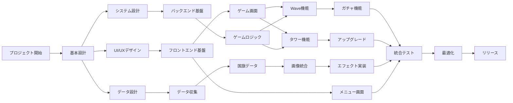

# Critical Path Method (CPM) タスク分解

## プロジェクト全体のタスク構造

## タスク詳細と担当者

### Phase 1: 基盤構築（並列実行可能）

| タスク | 期間 | 担当 | 前提条件 | 成果物 |
|--------|------|------|----------|---------|
| **UI/UXデザイン** | 3日 | UIデザイナー | - | デザインモック、スタイルガイド |
| **システム設計** | 3日 | システムアーキテクト | - | クラス図、API仕様 |
| **データ設計** | 2日 | データエンジニア | - | DB設計、データ構造定義 |
| **国旗画像収集** | 5日 | デザイナー | データ設計完了 | 250カ国の国旗画像 |
| **GDPデータ収集** | 2日 | データエンジニア | データ設計完了 | GDPデータベース |

### Phase 2: コア機能開発（一部並列可能）

| タスク | 期間 | 担当 | 前提条件 | 成果物 |
|--------|------|------|----------|---------|
| **React基盤構築** | 2日 | フロントエンド | UI設計完了 | 基本コンポーネント |
| **Canvas実装** | 3日 | ゲームエンジニア | React基盤完了 | ゲーム画面 |
| **Wave管理** | 4日 | ゲームエンジニア | Canvas完了 | Wave機能 |
| **タワーシステム** | 4日 | ゲームエンジニア | Canvas完了 | タワー配置・攻撃 |
| **敵AI実装** | 3日 | AIエンジニア | Wave管理完了 | 敵の移動・行動 |
| **セーブシステム** | 2日 | フルスタック | React基盤完了 | セーブ/ロード機能 |

### Phase 3: 拡張機能（並列実行推奨）

| タスク | 期間 | 担当 | 前提条件 | 成果物 |
|--------|------|------|----------|---------|
| **ガチャ実装** | 3日 | フロントエンド | Wave管理完了 | ガチャUI・ロジック |
| **アップグレード** | 3日 | ゲームエンジニア | タワー完了 | 強化システム |
| **エフェクト** | 5日 | グラフィックエンジニア | 画像統合完了 | 攻撃エフェクト |
| **サウンド** | 3日 | サウンドデザイナー | - | BGM・効果音 |
| **UI画面群** | 4日 | フロントエンド | React基盤完了 | メニュー・設定画面 |

### Phase 4: 品質保証（一部並列可能）

| タスク | 期間 | 担当 | 前提条件 | 成果物 |
|--------|------|------|----------|---------|
| **単体テスト作成** | 3日 | 各開発者 | 各機能完了 | テストコード |
| **統合テスト** | 4日 | QAエンジニア | 全機能完了 | テストレポート |
| **パフォーマンス最適化** | 3日 | パフォーマンスエンジニア | 統合テスト完了 | 最適化レポート |
| **バグ修正** | 5日 | 全開発者 | テスト完了 | 修正済みビルド |
| **ドキュメント作成** | 3日 | テクニカルライター | - | 技術文書 |

## クリティカルパス

最長経路（25日）:
1. システム設計 (3日)
2. React基盤構築 (2日)
3. Canvas実装 (3日)
4. Wave管理 (4日)
5. ガチャ実装 (3日)
6. 統合テスト (4日)
7. バグ修正 (5日)
8. リリース準備 (1日)

## 並列化による期間短縮

### 最適な人員配置（8名体制）

1. **UIデザイナー** (1名)
   - UI/UXデザイン → 国旗画像収集 → UI調整

2. **フロントエンドエンジニア** (2名)
   - A: React基盤 → セーブシステム → UI画面群
   - B: ガチャ実装 → アップグレード画面

3. **ゲームエンジニア** (2名)
   - A: Canvas → Wave管理 → 統合
   - B: タワーシステム → アップグレード機能

4. **バックエンドエンジニア** (1名)
   - システム設計 → データ管理 → 最適化

5. **グラフィックエンジニア** (1名)
   - エフェクト実装 → パフォーマンス調整

6. **QA/テストエンジニア** (1名)
   - テスト計画 → 単体テスト支援 → 統合テスト

### 並列実行による短縮効果

- 通常: 約40日
- 並列化: 約25日（38%短縮）

## リスク管理

### 高リスクタスク
1. **国旗画像収集**: 著作権確認が必要
2. **パフォーマンス**: 250カ国×エフェクトの負荷
3. **ブラウザ互換性**: Canvas APIの差異

### 対策
- 早期プロトタイプによる検証
- 段階的な機能追加
- 継続的なパフォーマンステスト

## マイルストーン

1. **Day 5**: 基本設計完了
2. **Day 10**: コア機能動作確認
3. **Day 15**: 全機能実装完了
4. **Day 20**: テスト完了
5. **Day 25**: リリース準備完了