# Flag Defence - Critical Path Method (CPM) タスク分解

## プロジェクト全体のCPMネットワーク図

```mermaid
graph LR
    A[プロジェクト開始] --> B[要件定義・仕様策定]
    B --> C[技術選定・環境構築]
    C --> D[基本システム設計]
    
    D --> E[ゲームループ実装]
    D --> F[データモデル設計]
    
    E --> G[Canvas描画システム]
    F --> H[国家データベース作成]
    
    G --> I[パスシステム実装]
    H --> J[GDPシステム実装]
    
    I --> K[敵移動システム]
    J --> K
    
    K --> L[タワー配置システム]
    L --> M[攻撃システム基本実装]
    
    M --> N[特殊能力システム]
    M --> O[ガチャシステム]
    
    N --> P[統合テスト1]
    O --> P
    
    P --> Q[ショップシステム]
    P --> R[セーブシステム]
    
    Q --> S[UIシステム完成]
    R --> S
    
    S --> T[統合テスト2]
    T --> U[バグ修正・調整]
    U --> V[ドキュメント作成]
    V --> W[リリース準備]
    W --> X[プロジェクト完了]
    
    style A fill:#f9f,stroke:#333,stroke-width:4px
    style X fill:#9f9,stroke:#333,stroke-width:4px
    style E fill:#ff9,stroke:#333,stroke-width:2px
    style K fill:#ff9,stroke:#333,stroke-width:2px
    style P fill:#ff9,stroke:#333,stroke-width:2px
    style T fill:#ff9,stroke:#333,stroke-width:2px
```

## フェーズ別タスク詳細

### Phase 1: 基盤構築（1-3日目）
| タスクID | タスク名 | 期間 | 担当チーム | 前提タスク | 成果物 |
|---------|---------|------|-----------|-----------|---------|
| T001 | 要件定義・仕様策定 | 4h | PM+全体 | - | game-specification.md |
| T002 | 技術選定・環境構築 | 2h | インフラ | T001 | package.json, vite.config |
| T003 | プロジェクト構造設計 | 2h | アーキテクト | T002 | ディレクトリ構造 |
| T004 | 基本UIレイアウト | 3h | フロントエンド | T003 | App.tsx, index.css |
| T005 | Canvasセットアップ | 2h | グラフィックス | T003 | canvas基本描画 |

### Phase 2: コアゲームシステム（4-7日目）
| タスクID | タスク名 | 期間 | 担当チーム | 前提タスク | 成果物 |
|---------|---------|------|-----------|-----------|---------|
| T006 | ゲームループ実装 | 4h | コア開発 | T005 | minimal-game.tsx |
| T007 | 国家データベース作成 | 6h | データ | T001 | nations-full-list.ts |
| T008 | パスシステム実装 | 3h | アルゴリズム | T005 | improved-path.tsx |
| T009 | 敵生成・移動システム | 4h | ゲームロジック | T006,T008 | GDPEnemy class |
| T010 | GDPベースHP計算 | 2h | バランス | T007,T009 | gdp-enemy-system.tsx |
| T011 | タワー配置システム | 3h | インタラクション | T006 | Tower placement |
| T012 | 基本攻撃システム | 4h | 戦闘システム | T011 | Attack logic |

### Phase 3: 特殊システム（8-11日目）
| タスクID | タスク名 | 期間 | 担当チーム | 前提タスク | 成果物 |
|---------|---------|------|-----------|-----------|---------|
| T013 | 国旗レンダリング | 3h | グラフィックス | T007 | flag-renderer.tsx |
| T014 | 特殊能力設計 | 4h | ゲームデザイン | T012 | nation-abilities.tsx |
| T015 | 特殊能力実装 | 6h | 戦闘システム | T014 | AbilityProcessor |
| T016 | ガチャシステム設計 | 2h | ゲームデザイン | T007 | Gacha仕様 |
| T017 | ガチャシステム実装 | 3h | フィーチャー | T016 | simple-gacha.tsx |
| T018 | Wave管理システム | 3h | ゲームロジック | T009 | Wave timer, spawning |

### Phase 4: メタシステム（12-14日目）
| タスクID | タスク名 | 期間 | 担当チーム | 前提タスク | 成果物 |
|---------|---------|------|-----------|-----------|---------|
| T019 | ショップUI設計 | 2h | UI/UX | - | Shop mockup |
| T020 | ショップシステム実装 | 4h | フィーチャー | T019 | shop-system.tsx |
| T021 | パワーアップシステム | 3h | ゲームロジック | T020 | GameModifiers |
| T022 | セーブスロット設計 | 2h | データ | - | Save仕様 |
| T023 | セーブシステム実装 | 4h | データ永続化 | T022 | save-slots.tsx |
| T024 | 残機システム | 2h | ゲームロジック | T009 | Lives logic |

### Phase 5: 統合・仕上げ（15-18日目）
| タスクID | タスク名 | 期間 | 担当チーム | 前提タスク | 成果物 |
|---------|---------|------|-----------|-----------|---------|
| T025 | システム統合 | 6h | コア開発 | T015,T017,T021,T023 | integrated-game-v2.tsx |
| T026 | UI/UX改善 | 4h | フロントエンド | T025 | Polished UI |
| T027 | バランス調整 | 4h | ゲームデザイン | T025 | 数値調整 |
| T028 | バグ修正 | 6h | QA | T025 | Bug fixes |
| T029 | パフォーマンス最適化 | 3h | 最適化 | T028 | Performance improvements |

### Phase 6: ドキュメント・リリース（19-20日目）
| タスクID | タスク名 | 期間 | 担当チーム | 前提タスク | 成果物 |
|---------|---------|------|-----------|-----------|---------|
| T030 | アーキテクチャ図作成 | 3h | ドキュメント | T025 | architecture/*.md |
| T031 | テスト仕様書作成 | 2h | QA | T028 | test-strategy.md |
| T032 | デプロイ設定 | 2h | DevOps | T029 | Deploy config |
| T033 | 最終テスト | 3h | QA | T032 | Test report |
| T034 | リリース準備 | 2h | リリース | T033 | Release package |

## クリティカルパス

**クリティカルパス**: T001 → T002 → T003 → T005 → T006 → T009 → T012 → T015 → T025 → T028 → T033 → T034

**総所要時間**: 約58時間（実働約7.25日）

## チーム編成案

1. **コア開発チーム** (2名)
   - ゲームループ、統合作業担当
   - リーダー: シニアエンジニア

2. **フィーチャーチーム** (2名)  
   - ガチャ、ショップ、セーブ機能担当
   - 並列作業で効率化

3. **グラフィックス・UIチーム** (1名)
   - Canvas描画、UI/UX担当
   - デザインセンス重視

4. **データ・バランスチーム** (1名)
   - 国家データ、GDP計算、バランス調整
   - 数値設計の専門性

5. **QA・ドキュメントチーム** (1名)
   - テスト、バグ修正、ドキュメント作成
   - 品質保証重視

## リスク管理

### 高リスクタスク
- T015: 特殊能力実装（複雑性高）
- T025: システム統合（依存関係多）
- T028: バグ修正（見積もり困難）

### 緩和策
- 早期プロトタイプ作成
- 段階的統合テスト
- バッファ時間の確保（各フェーズ10%）